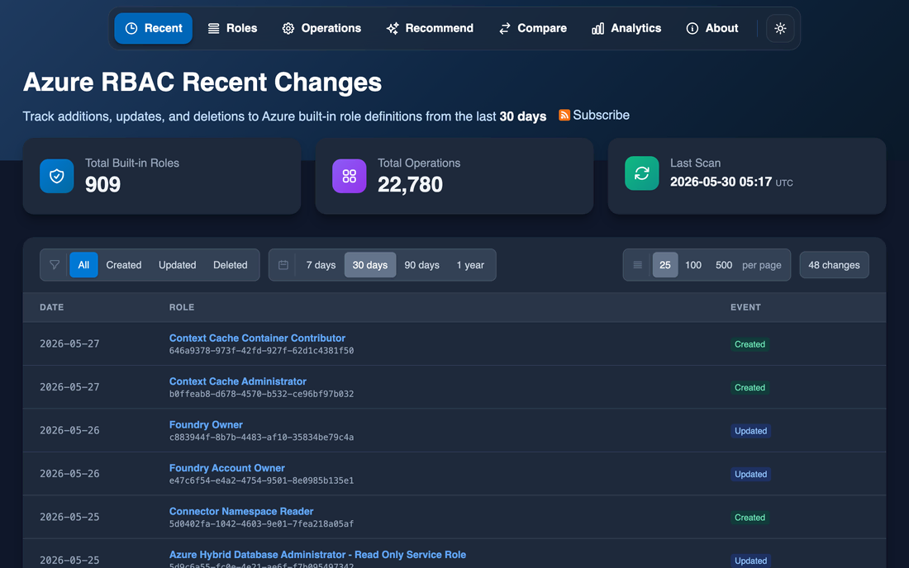
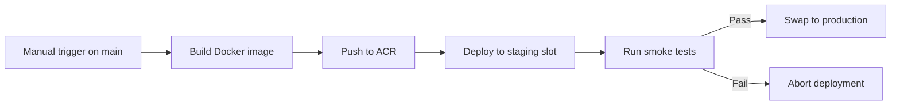

# Azure RBAC Catalog

[](https://github.com/atomassi/rbac-catalog/actions/workflows/build.yml)
[](https://github.com/atomassi/rbac-catalog/actions/workflows/deploy.yml)
[](https://github.com/atomassi/rbac-catalog/actions/workflows/github-code-scanning/codeql)
[](https://codecov.io/gh/atomassi/rbac-catalog)
[](https://www.python.org/downloads/)
[](https://github.com/atomassi/rbac-catalog/releases/latest)
[](LICENSE)

> [!IMPORTANT]
> **The public site at [rbac-catalog.dev](https://rbac-catalog.dev/) will be decommissioned on June 12, 2026.**
>
> The full source (application code, Bicep templates, and post-deploy
> scripts) stays in this repository under the MIT license. You have two
> ways to keep using it:
>
> - **Run it locally** — see [`docs/run-local.md`](docs/run-local.md).
> - **Deploy your own copy on Azure** — see the step-by-step walkthrough
>   in [`infra/README.md`](infra/README.md).

---

**Live site:** [rbac-catalog.dev](https://rbac-catalog.dev/)

A comprehensive catalog and monitoring tool for [Azure built-in RBAC roles](https://learn.microsoft.com/en-us/azure/role-based-access-control/built-in-roles). Browse roles, explore their permissions, track changes over time, find least-privilege roles based on operation requirements, and get AI-powered role recommendations.

[](https://rbac-catalog.dev/)

## Contents

- [Features](#features)
- [Quick Start](#quick-start)
- [Documentation](#documentation)
- [Tech Stack](#tech-stack)
- [Infrastructure & Costs](#infrastructure--costs)
- [AI Recommendation Modes](#ai-recommendation-modes)
- [MCP Server Integration](#mcp-server-integration)
- [Testing](#testing)
- [Deployment](#deployment)
- [Project Structure](#project-structure)
- [References](#references)

## Features

- **Role Catalog** — Browse all 800+ Azure built-in roles with full permission details
- **Operation Explorer** — Search 20,000+ resource provider operations and see which roles grant each one
- **Least-Privilege Calculator** — Input operations you need, get roles ranked by fewest excess permissions
- **Reverse Lookup** — "Which roles grant this operation?" answered instantly
- **Change Tracking** — Daily scans detect when Microsoft adds, modifies, or deprecates roles
- **Diff Viewer** — See exactly what changed between role versions
- **Related Roles** — See similar roles ranked by permission overlap, with subset/superset indicators
- **Role Comparison** — Compare any two roles side by side
- **Analytics** — Visualize permission distribution, role changes over time, and provider stats
- **AI Role Recommender** — Describe what you need in natural language, get least-privilege suggestions (experimental)
- **MCP Server** — Integrate with AI agents (Copilot, Claude) via Model Context Protocol
- **RSS/Atom Feeds** — Subscribe to role changes in your favorite feed reader

## Quick Start

Run the catalog locally in a few minutes. You need **Python 3.12, 3.13, or 3.14** and **Git**.

```bash
git clone https://github.com/atomassi/rbac-catalog.git
cd rbac-catalog
python3.12 -m venv .venv && source .venv/bin/activate
pip install --upgrade pip && pip install -r requirements.txt

# Boot fast with only the lightweight recommender engine
ENABLED_AI_ENGINES=tfidf uvicorn azurerbac.web.app:app --port 8000 --reload
```

Open <http://localhost:8000>. The UI and search work immediately; the catalog
stays empty until the background worker runs its first scan. To populate it with
live data, run `az login` once, then start the worker in a second terminal:

```bash
python -m azurerbac.backgroundjobs.worker
```

Prefer containers? Build and run the image instead:

```bash
docker build -t azurerbac:local --build-arg VERSION=local-dev .
docker run --rm -p 8000:8000 azurerbac:local
```

For prerequisites, environment variables, and the full walkthrough, see
[`docs/run-local.md`](docs/run-local.md).

## Documentation

| Guide | What it covers |
|-------|----------------|
| [`docs/run-local.md`](docs/run-local.md) | Run the app locally with native Python or Docker — prerequisites, environment variables, and the full walkthrough |
| [`infra/README.md`](infra/README.md) | Deploy your own copy on Azure with the Bicep templates, step by step |
| [`docs/ai-recommender.md`](docs/ai-recommender.md) | How the 8 AI modes work, plus the LLM fine-tuning pipeline (Unsloth + Qwen) |
| [`docs/mcp.md`](docs/mcp.md) | MCP server tools, example queries, direct invocations, and rate limits |

## Tech Stack

| Layer | Technologies |
|-------|-------------|
| **Backend** | Python 3.12+, FastAPI, SQLAlchemy, Pydantic |
| **Frontend** | Jinja2 templates, Tailwind CSS, Alpine.js |
| **Database** | PostgreSQL |
| **AI/ML** | PyTorch, Ollama, sentence-transformers, Qwen (fine-tuned) |
| **Hosting** | Azure App Service, Cloudflare CDN |
| **CI/CD** | GitHub Actions, Azure Container Registry, Docker |
| **Testing** | pytest, Playwright |
| **Ops Automation** | Azure Automation |

## Infrastructure & Costs

The architecture favors simplicity over scale: managed Azure services do the
heavy lifting, fronted by Cloudflare's free tier and backed by a single
PostgreSQL instance. There's no Kubernetes, no autoscaling, and no multi-region
failover — just the moving parts a low-traffic public catalog actually needs.

Self-hosted LLM inference runs on two **optional** VMs that the catalog works
fine without. They exist because one goal of this project was to experiment with
self-hosted LLMs end to end: fine-tuning with Unsloth and serving the result
through Ollama.

### Architecture


### Current Cost

> [!TIP]
> The catalog runs comfortably on the **core** services below for **~$65/month**. The **optional** self-hosted inference VMs roughly double the bill; skip them and the AI features that depend on the local LLM are simply unavailable, while the rest of the catalog works as-is.

**Core services** — required to run the catalog:

| Service | $/month | Notes |
|---------|--------:|-------|
| Cloudflare | $0 | Free plan — fronts the App Service with global CDN caching, TLS termination, DDoS protection, custom security rules, rate limiting, and OpenAPI schema validation at the edge. |
| App Service | ~$45 | P0v3 Linux, single instance. Cheapest SKU that supports deployment slots. |
| PostgreSQL | ~$13 | Flexible Server, B1ms (Burstable, 1 vCPU / 2 GiB). |
| Container Registry | ~$5 | Basic SKU. |
| App Insights + Log Analytics | ~$2 | Pay-per-GB ingestion, 30-day retention. |
| Automation Account | $0 | Basic SKU, within the 500 min/month free tier. |
| **Subtotal** | **~$65** | |

**Optional services** — self-hosted LLM inference and fine-tuning:

| Service | $/month | Notes |
|---------|--------:|-------|
| Ollama VM (inference) | ~$50 | B2ms (2 vCPU, 8 GiB), always-on. Runs the fine-tuned Qwen 0.5B model. |
| GPU VM (training/finetuning) | on-demand (~$1/hour) | NV12ads A10 v5 (1× NVIDIA A10). Started only for finetuning runs. |
| **Subtotal** | **~$50** | |

**Total: ~$115/month** baseline (core + always-on Ollama VM). The GPU VM is excluded — it's billed only while a finetuning run is active, at ~$1/hour, so add roughly that per GPU-hour on top.

## AI Recommendation Modes

> [!NOTE]
> The AI modes are experimental, built as a playground for trying out different recommendation approaches and for learning LLM fine-tuning ([Unsloth](https://unsloth.ai/docs) + Qwen, served via [Ollama](https://ollama.com/)). Results should be verified. Access them via the "Show AI Tools" toggle on the Recommend page.

The AI Role Recommender supports **7 different modes**, each with different speed/accuracy trade-offs:

| Mode | Description | Requires |
|------|-------------|----------|
| **TF-IDF** | Enhanced TF-IDF + BM25 keyword matching | CPU only |
| **Semantic** | Pure sentence embedding similarity | Embeddings |
| **Cross-Encoder** | Bi-encoder retrieval + neural reranking | Embeddings |
| **LLM** | Fine-tuned Qwen model direct inference | Ollama |
| **RAG** | Retrieval-Augmented Generation with LLM reranking | Embeddings + Ollama |
| **HyDE** | Hypothetical document generation + semantic search | Embeddings + Ollama |
| **Hybrid** | Multi-stage: TF-IDF → Embeddings → LLM pipeline | All components |

See [docs/ai-recommender.md](docs/ai-recommender.md) for the LLM fine-tuning approach and how the underlying knowledge base (`document_text`) is built.

## MCP Server Integration

Azure RBAC Catalog exposes an [MCP (Model Context Protocol)](https://modelcontextprotocol.io/) server at `https://rbac-catalog.dev/mcp/` for AI assistants like GitHub Copilot, Claude, and Cursor. Add it to VS Code by creating `.vscode/mcp.json`:

```json
{
  "servers": {
    "azure-rbac-catalog": {
      "type": "http",
      "url": "https://rbac-catalog.dev/mcp/"
    }
  }
}
```

Then ask your assistant something like *"Find the least-privilege role for reading Key Vault secrets"*.

See [docs/mcp.md](docs/mcp.md) for the full tool reference, example queries, direct invocations, and rate-limiting details.

## Testing

```bash
# Unit tests (Python 3.12, 3.13, or 3.14)
pytest tests/ -q --cov=azurerbac

# E2E tests
npm ci
npx playwright install chromium
npm run test:e2e

# Smoke tests (pre-production validation)
pip install httpx
python scripts/smoke_tests.py --url https://your-staging-url.azurewebsites.net
```

## Deployment

### CI pipeline

Deployments to the live site use a **staging-first approach** with automatic promotion:



1. **Build** — GitHub Actions builds a versioned Docker image
2. **Push to ACR** — The image is pushed to Azure Container Registry
3. **Deploy to Staging** — The image is deployed to the App Service staging slot
4. **Smoke Tests** — Automated tests validate pages, APIs, and AI recommender endpoints
5. **Slot Swap** — If all tests pass, staging is swapped to production

This ensures every production deployment is validated before users see it.

> See [Azure App Service staging slots](https://learn.microsoft.com/en-us/azure/app-service/deploy-staging-slots) for more details.

## Project Structure

```
azurerbac/
├── airecommender/   # AI recommendation engines (8 modes)
├── analytics/       # Permission distribution, change-over-time, and provider stats
├── azure/           # Azure SDK integration (roles, operations)
├── backgroundjobs/  # Scheduled tasks and background workers
├── cache/           # Caching layer for roles and operations
├── comparer/        # Role comparison logic (three-way permission diffs)
├── core/            # Database models and utilities
├── matching/        # Operation-to-role matching for least-privilege role composition
├── mcp/             # MCP server for AI assistant integrations
├── telemetry/       # Application Insights integration
└── web/             # FastAPI app, routes, templates

infra/               # Bicep IaC + scripts to deploy your own copy to Azure
scripts/             # Deployment and smoke test scripts
tests/               # Unit tests
e2e/                 # Playwright end-to-end tests
```

## References

- **TF-IDF/BM25**: Robertson & Zaragoza, [The Probabilistic Relevance Framework: BM25 and Beyond](https://www.staff.city.ac.uk/~sbrp622/papers/foundations_bm25_review.pdf) (2009)
- **Sentence-BERT**: Reimers & Gurevych, [Sentence Embeddings using Siamese BERT-Networks](https://arxiv.org/abs/1908.10084) (2019)
- **Cross-Encoder**: Humeau et al., [Poly-encoders: Architectures and Pre-training Strategies](https://arxiv.org/abs/1905.01969) (2019)
- **Qwen**: Bai et al., [Qwen Technical Report](https://arxiv.org/abs/2309.16609) (2023)
- **RAG**: Lewis et al., [Retrieval-Augmented Generation for Knowledge-Intensive NLP Tasks](https://arxiv.org/abs/2005.11401) (2020)
- **HyDE**: Gao et al., [Precise Zero-Shot Dense Retrieval without Relevance Labels](https://arxiv.org/abs/2212.10496) (2022)

