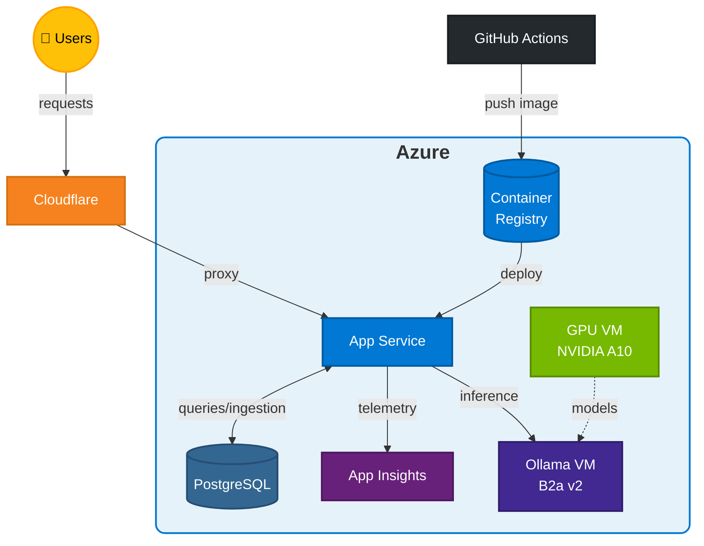

# Azure RBAC Catalog

[](https://github.com/atomassi/azurerbac-builtinroles/actions/workflows/build.yml)
[](https://github.com/atomassi/azurerbac-builtinroles/actions/workflows/build.yml)
[](https://www.python.org/downloads/)
[](https://github.com/astral-sh/ruff)

**Live site:** [rbac-catalog.dev](https://rbac-catalog.dev/recommend?ai=1)

A comprehensive catalog and monitoring tool for [Azure built-in RBAC roles](https://learn.microsoft.com/en-us/azure/role-based-access-control/built-in-roles). Browse roles, explore their permissions, track changes over time, find least-privilege roles based on operation requirements, and get AI-powered role recommendations.

## Features

- **Role Catalog** — Browse all 800+ Azure built-in roles with full permission details
- **Operation Explorer** — Search 15,000+ resource provider operations
- **Change Tracking** — Monitor when Microsoft adds, modifies, or deprecates roles
- **AI Role Recommender** — Describe what you need in natural language, get least-privilege role suggestions
- **Diff Viewer** — See exactly what changed between role versions
- **8 AI Recommendation Modes** — From fast keyword matching to LLM-powered semantic understanding

## Tech Stack

| Layer | Technologies |
|-------|-------------|
| **Backend** | Python 3.12+, FastAPI, SQLAlchemy, Pydantic |
| **Frontend** | Jinja2 templates, Tailwind CSS, Alpine.js |
| **Database** | PostgreSQL |
| **AI/ML** | Ollama, sentence-transformers, ColBERT, Qwen (fine-tuned) |
| **Hosting** | Azure App Service, Cloudflare CDN |
| **CI/CD** | GitHub Actions, Docker |

## Infrastructure & Costs

The site runs on Azure with Cloudflare CDN.

### Architecture



### Cost

| Service | $/month |
|---------|--------:|
| Cloudflare | $0 |
| App Service | ~$45 |
| PostgreSQL Flexible | ~$13 |
| Container Registry | ~$5 |
| App Insights | ~$5 |
| Ollama VM (inference) | ~$32 |
| GPU VM (training/finetuning) | on-demand (~1$/hour) |
| **Total** | **~$100** |

## AI Recommendation Modes

> [!NOTE]
> The primary goal of this project is learning. These recommendation modes are a work in progress and may produce inaccurate results. Further improvements and tuning are expected.

The AI Role Recommender supports **8 different modes**, each with different speed/accuracy trade-offs:

| Mode | Description | Requires |
|------|-------------|----------|
| **TF-IDF** | Enhanced TF-IDF + BM25 keyword matching | CPU only |
| **Semantic** | Pure sentence embedding similarity | Embeddings |
| **ColBERT** | Token-level late interaction for precise matching | ColBERT index |
| **Cross-Encoder** | Bi-encoder retrieval + neural reranking | Embeddings |
| **LLM** | Fine-tuned Qwen model direct inference | Ollama |
| **RAG** | Retrieval-Augmented Generation with LLM reranking | Embeddings + Ollama |
| **HyDE** | Hypothetical document generation + semantic search | Embeddings + Ollama |
| **Hybrid** | Multi-stage: TF-IDF → Embeddings → LLM pipeline | All components |

### Mode Selection

- **Fast & Offline**: Use `tfidf` or `semantic` — no LLM required
- **Best Accuracy**: Use `llm` or `hybrid` — requires Ollama with fine-tuned model
- **Balanced**: Use `crossencoder` or `colbert` — good accuracy without LLM latency

## Fine-Tuning

The LLM mode uses a fine-tuned [Qwen2.5-0.5B-Instruct](https://huggingface.co/Qwen/Qwen2.5-0.5B-Instruct) model trained specifically for Azure RBAC role matching.

### Approach

Fine-tuning was done using [Unsloth](https://github.com/unslothai/unsloth) for efficient LoRA training on consumer hardware. The model takes natural language queries like "I need to read blob storage" and outputs structured JSON with role recommendations and confidence scores.

## Testing

```bash
# Unit tests (runs on Python 3.12-3.13)
pytest tests/ -q --cov=azurerbac

# E2E tests
npm ci
npx playwright install chromium
npm run test:e2e
```

## Project Structure

```
azurerbac/
├── airecommender/   # AI recommendation engines (8 modes)
├── azure/           # Azure SDK integration (roles, operations)
├── backgroundjobs/  # Scheduled tasks and background workers
├── cache/           # Caching layer for roles and operations
├── core/            # Database models and utilities
├── matching/        # Operation-to-role matching for least-privilege role composition
├── telemetry/       # Application Insights integration
└── web/             # FastAPI app, routes, templates

tests/               # Unit and integration tests
e2e/                 # Playwright end-to-end tests
```

## References

- **TF-IDF/BM25**: Robertson & Zaragoza, [The Probabilistic Relevance Framework: BM25 and Beyond](https://www.staff.city.ac.uk/~sbrp622/papers/foundations_bm25_review.pdf) (2009)
- **Sentence-BERT**: Reimers & Gurevych, [Sentence Embeddings using Siamese BERT-Networks](https://arxiv.org/abs/1908.10084) (2019)
- **ColBERT**: Khattab & Zaharia, [Efficient and Effective Passage Search via Contextualized Late Interaction](https://arxiv.org/abs/2004.12832) (2020)
- **Cross-Encoder**: Humeau et al., [Poly-encoders: Architectures and Pre-training Strategies](https://arxiv.org/abs/1905.01969) (2019)
- **Qwen**: Bai et al., [Qwen Technical Report](https://arxiv.org/abs/2309.16609) (2023)
- **RAG**: Lewis et al., [Retrieval-Augmented Generation for Knowledge-Intensive NLP Tasks](https://arxiv.org/abs/2005.11401) (2020)
- **HyDE**: Gao et al., [Precise Zero-Shot Dense Retrieval without Relevance Labels](https://arxiv.org/abs/2212.10496) (2022)