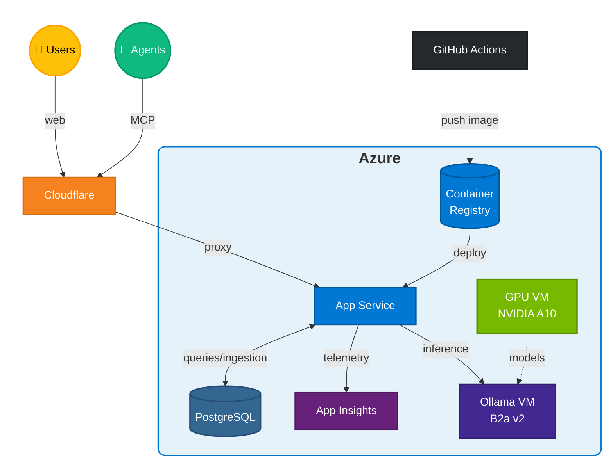
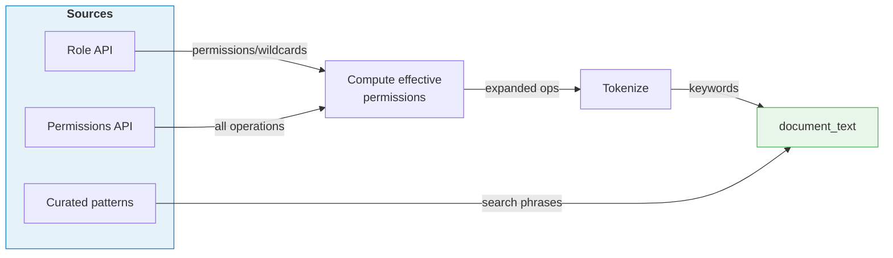
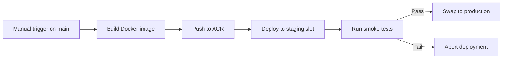

# Azure RBAC Catalog

[](https://github.com/atomassi/rbac-catalog/actions/workflows/build.yml)
[](https://github.com/atomassi/rbac-catalog/actions/workflows/deploy.yml)
[](https://github.com/atomassi/rbac-catalog/actions/workflows/build.yml)
[](https://www.python.org/downloads/)
[](https://github.com/astral-sh/ruff)

**Live site:** [rbac-catalog.dev](https://rbac-catalog.dev/)

A comprehensive catalog and monitoring tool for [Azure built-in RBAC roles](https://learn.microsoft.com/en-us/azure/role-based-access-control/built-in-roles). Browse roles, explore their permissions, track changes over time, find least-privilege roles based on operation requirements, and get AI-powered role recommendations.

## Features

- **Role Catalog** — Browse all 800+ Azure built-in roles with full permission details
- **Operation Explorer** — Search 20,000+ resource provider operations and see which roles grant each one
- **Least-Privilege Calculator** — Input operations you need, get roles ranked by fewest excess permissions
- **Reverse Lookup** — "Which roles grant this operation?" answered instantly
- **Change Tracking** — Daily scans detect when Microsoft adds, modifies, or deprecates roles
- **Diff Viewer** — See exactly what changed between role versions
- **Related Roles** — See similar roles ranked by permission overlap, with subset/superset indicators
- **Role Comparison** — Compare any two roles side by side
- **Analytics** — Visualize permission distribution, role changes over time, and provider stats
- **AI Role Recommender** — Describe what you need in natural language, get least-privilege suggestions (experimental)
- **MCP Server** — Integrate with AI agents (Copilot, Claude) via Model Context Protocol
- **RSS/Atom Feeds** — Subscribe to role changes in your favorite feed reader

## Tech Stack

| Layer | Technologies |
|-------|-------------|
| **Backend** | Python 3.12+, FastAPI, SQLAlchemy, Pydantic |
| **Frontend** | Jinja2 templates, Tailwind CSS, Alpine.js |
| **Database** | PostgreSQL |
| **AI/ML** | PyTorch, Ollama, sentence-transformers, ColBERT, Qwen (fine-tuned) |
| **Hosting** | Azure App Service, Cloudflare CDN |
| **CI/CD** | GitHub Actions, Azure Container Registry, Docker |
| **Testing** | pytest, Playwright |
| **Ops Automation** | Azure Automation |

## Infrastructure & Costs

The site runs on Azure with Cloudflare CDN.

### Architecture



### Cost

| Service | $/month |
|---------|--------:|
| Cloudflare | $0 |
| App Service | ~$45 |
| PostgreSQL | ~$13 |
| Container Registry | ~$5 |
| App Insights + Log Analytics | ~$5 |
| Automation Account | < $1 |
| Ollama VM (inference) | ~$32 |
| GPU VM (training/finetuning) | on-demand (~$1/hour) |
| **Total** | **~$100** |

## AI Recommendation Modes

> [!NOTE]
> The AI modes are experimental—built for learning and experimenting with different recommendation approaches. Results should be verified. Access them via the "Show AI Tools" toggle on the Recommend page.

The AI Role Recommender supports **8 different modes**, each with different speed/accuracy trade-offs:

| Mode | Description | Requires |
|------|-------------|----------|
| **TF-IDF** | Enhanced TF-IDF + BM25 keyword matching | CPU only |
| **Semantic** | Pure sentence embedding similarity | Embeddings |
| **ColBERT** | Token-level late interaction for precise matching | ColBERT index |
| **Cross-Encoder** | Bi-encoder retrieval + neural reranking | Embeddings |
| **LLM** | Fine-tuned Qwen model direct inference | Ollama |
| **RAG** | Retrieval-Augmented Generation with LLM reranking | Embeddings + Ollama |
| **HyDE** | Hypothetical document generation + semantic search | Embeddings + Ollama |
| **Hybrid** | Multi-stage: TF-IDF → Embeddings → LLM pipeline | All components |

## MCP Server Integration

Azure RBAC Catalog exposes an [MCP (Model Context Protocol)](https://modelcontextprotocol.io/) server for AI assistants like GitHub Copilot, Claude, and Cursor. This allows AI tools to query Azure RBAC data directly.

### Endpoint

```
https://rbac-catalog.dev/mcp/
```

The server uses Streamable HTTP transport (stateless mode with JSON responses) for scalable communication.

### VS Code / GitHub Copilot Setup

Create `.vscode/mcp.json` in your workspace:

```json
{
  "servers": {
    "azure-rbac-catalog": {
      "type": "http",
      "url": "https://rbac-catalog.dev/mcp/"
    }
  }
}
```

### Available Tools

| Tool | Description |
|------|-------------|
| `search_operations` | Search Azure operations by name/pattern (supports wildcards like `Microsoft.Storage/*/read`) |
| `search_roles` | Search roles by name or description |
| `get_role` | Get detailed role info including all permissions |
| `get_role_permissions` | Get expanded list of actual operations a role grants |
| `recommend_roles` | Find least-privilege roles for specific operations |
| `ai_recommend` | Natural language role recommendations |

### Example Usage

**Natural language queries you can ask your AI assistant:**

```
- "What permissions does the Storage Blob Data Contributor role have?"
- "Compare Storage Blob Data Contributor and Storage Blob Data Owner"
- "Which roles allow Microsoft.Storage/storageAccounts/blobServices/containers/blobs/read and Microsoft.Storage/storageAccounts/blobServices/containers/blobs/tags/read?"
- "What operations correspond to Microsoft.Storage/*?"
- "Describe role b7e6dc6d-f1e8-4753-8033-0f276bb0955b"
- "What Azure roles can read blob storage?"
- "Find the least-privilege role for reading Key Vault secrets"
```

**Direct tool invocations:**

Search for storage operations:
```
search_operations("Microsoft.Storage/storageAccounts/read", limit=10)
```

Find all operations under a resource provider (wildcard search):
```
search_operations("Microsoft.Storage/*", limit=50)
```

Find roles matching a description:
```
search_roles("blob storage", limit=5)
```

Get AI-powered recommendations:
```
ai_recommend("I need to read and write blobs in Azure Storage", top_k=3)
```

Find least-privilege roles for specific operations:
```
recommend_roles(["Microsoft.Storage/storageAccounts/read", "Microsoft.Storage/storageAccounts/blobServices/containers/read"], max_results=5)
```

Find roles that grant specific blob operations:
```
recommend_roles(["Microsoft.Storage/storageAccounts/blobServices/containers/blobs/read", "Microsoft.Storage/storageAccounts/blobServices/containers/blobs/tags/read"], max_results=5)
```

Get detailed info about a role by ID:
```
get_role("b7e6dc6d-f1e8-4753-8033-0f276bb0955b")
```

Get detailed info about a role by name:
```
get_role("Storage Blob Data Reader")
```

### Rate Limiting

The MCP server implements dual-layer rate limiting using token bucket algorithm:
- **Global**: Protects against server overload (shared bucket across all clients)
- **Per-session**: Prevents individual clients from monopolizing resources (separate bucket per session ID)

Tokens refill continuously at a configurable rate, allowing burst capacity while enforcing sustained limits. Rate-limited requests receive informative error messages with retry-after guidance. Session buckets use LRU eviction to bound memory usage.

## LLM Fine-Tuning

The LLM mode uses a fine-tuned [Qwen2.5-0.5B-Instruct](https://huggingface.co/Qwen/Qwen2.5-0.5B-Instruct) model trained specifically for Azure RBAC role matching.

### Approach

Fine-tuning was done using [Unsloth](https://github.com/unslothai/unsloth) for efficient LoRA training on consumer hardware. The model takes natural language queries like "I need to read blob storage" and outputs structured JSON with role recommendations and confidence scores.

## Knowledge Base

Each role is converted into a searchable `document_text` combining:
- **Role name & description** — From Azure's Role Definition API
- **Action keywords** — Tokenized from expanded permissions (e.g., `Microsoft.Compute/virtualMachines/powerOff/action` → `virtualmachines poweroff action`)
- **Curated patterns** — Human-written query examples (e.g., "read blob storage")



| Engine | How it uses `document_text` |
|--------|---------------------------|
| **TF-IDF** | BM25 keyword matching |
| **Semantic** | Embeds into vectors, cosine similarity |
| **ColBERT** | Token-level MaxSim matching |
| **LLM** | Doesn't use it—fine-tuned model predicts directly |

## Testing

```bash
# Unit tests (runs on Python 3.12-3.13)
pytest tests/ -q --cov=azurerbac

# E2E tests
npm ci
npx playwright install chromium
npm run test:e2e

# Smoke tests (pre-production validation)
pip install httpx
python scripts/smoke_tests.py --url https://your-staging-url.azurewebsites.net
```

## Deployment

### Deploy your own copy

Want to run this in your own Azure subscription? The
[`buildout/`](buildout/) folder ships single-file Bicep templates and helper
scripts to provision everything you need (App Service + ACR + PostgreSQL +
monitoring + optional staging/ppe slots) in ~15 minutes.

```bash
cd buildout
cp .env.example .env
$EDITOR .env                  # set SUBSCRIPTION_ID, RG_NAME, BASE_NAME, ...
source .env
az login && az account set --subscription "$SUBSCRIPTION_ID"
./scripts/deploy.sh prod
```

See [`buildout/README.md`](buildout/README.md) for the full step-by-step
walkthrough and [`buildout/ARCHITECTURE.md`](buildout/ARCHITECTURE.md) for
the design rationale.

### CI pipeline (this repo)

Deployments to the live site use a **staging-first approach** with automatic promotion:



1. **Build** — GitHub Actions builds a versioned Docker image
2. **Push to ACR** — The image is pushed to Azure Container Registry
3. **Deploy to Staging** — The image is deployed to the App Service staging slot
4. **Smoke Tests** — Automated tests validate pages, APIs, and AI recommender endpoints
5. **Slot Swap** — If all tests pass, staging is swapped to production

This ensures every production deployment is validated before users see it.

> See [Azure App Service staging slots](https://learn.microsoft.com/en-us/azure/app-service/deploy-staging-slots) for more details.

## Project Structure

```
azurerbac/
├── airecommender/   # AI recommendation engines (8 modes)
├── azure/           # Azure SDK integration (roles, operations)
├── backgroundjobs/  # Scheduled tasks and background workers
├── cache/           # Caching layer for roles and operations
├── comparer/        # Role comparison logic (three-way permission diffs)
├── core/            # Database models and utilities
├── matching/        # Operation-to-role matching for least-privilege role composition
├── mcp/             # MCP server for AI assistant integrations
├── telemetry/       # Application Insights integration
└── web/             # FastAPI app, routes, templates

scripts/             # Deployment and smoke test scripts
tests/               # Unit tests
e2e/                 # Playwright end-to-end tests
```

## References

- **TF-IDF/BM25**: Robertson & Zaragoza, [The Probabilistic Relevance Framework: BM25 and Beyond](https://www.staff.city.ac.uk/~sbrp622/papers/foundations_bm25_review.pdf) (2009)
- **Sentence-BERT**: Reimers & Gurevych, [Sentence Embeddings using Siamese BERT-Networks](https://arxiv.org/abs/1908.10084) (2019)
- **ColBERT**: Khattab & Zaharia, [Efficient and Effective Passage Search via Contextualized Late Interaction](https://arxiv.org/abs/2004.12832) (2020)
- **Cross-Encoder**: Humeau et al., [Poly-encoders: Architectures and Pre-training Strategies](https://arxiv.org/abs/1905.01969) (2019)
- **Qwen**: Bai et al., [Qwen Technical Report](https://arxiv.org/abs/2309.16609) (2023)
- **RAG**: Lewis et al., [Retrieval-Augmented Generation for Knowledge-Intensive NLP Tasks](https://arxiv.org/abs/2005.11401) (2020)
- **HyDE**: Gao et al., [Precise Zero-Shot Dense Retrieval without Relevance Labels](https://arxiv.org/abs/2212.10496) (2022)
