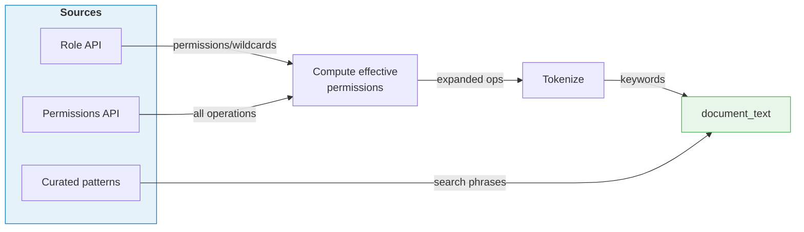

# AI Recommender: Implementation Notes

Internal implementation reference for the AI Role Recommender. The high-level mode table is in the [main README](../README.md#ai-recommendation-modes).

Every mode answers the same question, "which built-in role best fits this request?", but trades speed for accuracy differently. The keyword and embedding modes run on CPU in milliseconds; the LLM-backed modes call the local Qwen model and are slower but handle vaguer phrasing.

## LLM Fine-Tuning

The LLM mode uses a fine-tuned [Qwen2.5-0.5B-Instruct](https://huggingface.co/Qwen/Qwen2.5-0.5B-Instruct) model trained specifically for Azure RBAC role matching.

### Approach

Fine-tuning was done using [Unsloth](https://github.com/unslothai/unsloth) for efficient LoRA training on consumer hardware. The model takes natural-language queries like "I need to read blob storage" and outputs structured JSON with role recommendations and confidence scores.

## Knowledge Base

Each role is converted into a searchable `document_text` combining:

- **Role name & description** — From Azure's Role Definition API
- **Action keywords** — Tokenized from expanded permissions (e.g., `Microsoft.Compute/virtualMachines/powerOff/action` → `virtualmachines poweroff action`)
- **Curated patterns** — Human-written query examples (e.g., "read blob storage")

| Engine | How it uses `document_text` |
|--------|---------------------------|
| **TF-IDF** | BM25 keyword matching |
| **Semantic** | Embeds into vectors, cosine similarity |
| **LLM** | Doesn't use it — fine-tuned model predicts directly |

## Hybrid Pipeline

The **Hybrid** mode chains the cheaper engines into the LLM: TF-IDF narrows the catalog to a candidate set, semantic embeddings rerank those candidates by meaning, and the fine-tuned LLM makes the final selection. This keeps the expensive model focused on a short list instead of all 800+ roles, so it stays fast while still benefiting from the LLM's judgement on the close calls.
